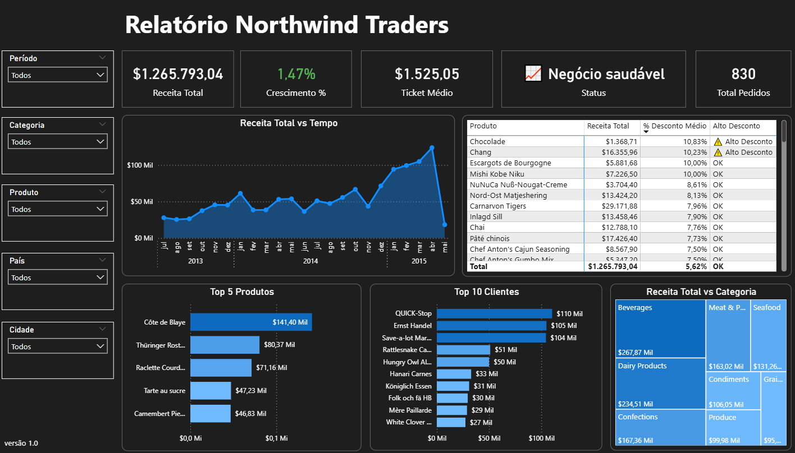

# 📊 Dashboard Northwind Traders - Análise de Vendas


## Objetivo

Desenvolver um dashboard no Power BI capaz de transformar dados transacionais em informações claras e úteis para apoiar a tomada de decisão, com foco em desempenho de vendas.

---

## Perguntas de Negócio

O dashboard foi construído para responder:

* O negócio está crescendo ou apresentando queda?
* Qual a tendência da receita ao longo do tempo?
* Quais categorias mais impactam o faturamento?
* Quais produtos têm maior contribuição para a receita?
* Quem são os principais clientes?
* O nível de desconto está impactando a performance?

---

## KPIs e Indicadores

**Receita Total**
Soma do valor vendido considerando preço, quantidade e desconto. Representa o volume financeiro do negócio.

**Crescimento (%)**
Variação percentual da receita em relação ao período anterior. Indica aceleração ou retração.

**Ticket Médio**
Receita média por pedido. Ajuda a entender o valor gerado por transação.

**Total de Pedidos**
Quantidade total de pedidos realizados. Mede o volume de operações.

**Status do Negócio**
Indicador baseado em regras (crescimento e ticket médio) que resume a situação do negócio de forma rápida.

---

## Justificativa do Design

O dashboard foi estruturado em uma única página com foco em clareza e usabilidade.

* **Clareza**: evita navegação entre múltiplas páginas
* **Hierarquia visual**: KPIs no topo, tendência no centro e análises detalhadas abaixo
* **Foco em decisão**: cada visual responde a uma pergunta específica
* **Simplicidade**: uso reduzido de cores e eliminação de elementos desnecessários

---

## Estrutura do Dashboard

**Visão Executiva**

* KPIs principais
* Indicador de status

**Tendência**

* Receita ao longo do tempo
* Comparação com período anterior

**Diagnóstico**

* Receita por categoria
* Top produtos
* Top clientes
* Análise de descontos

---

## Modelagem e Tratamento de Dados

* Tabela fato: `order_details`
* Tabelas dimensão: `orders`, `customers`, `products`, `categories`, `employees`, `shippers`
* Criação de medidas DAX para cálculo dos indicadores
* Validação do campo de desconto para garantir consistência nos cálculos

---

## Tecnologias Utilizadas

* Power BI
* DAX
* Modelagem de dados

---

## Estrutura do Repositório

```
northwind-dashboard/
 ┣ dashboard.pbix
 ┣ preview.png
 ┗ README.md
```

---

## Preview



---

## Como Utilizar

1. Baixe o arquivo `.pbix`
2. Abra no Power BI Desktop
3. Utilize os filtros para explorar os dados

---

## Considerações Finais

O projeto foi desenvolvido com foco em simplicidade, clareza e geração de valor, priorizando insights relevantes em vez de volume de informação.
